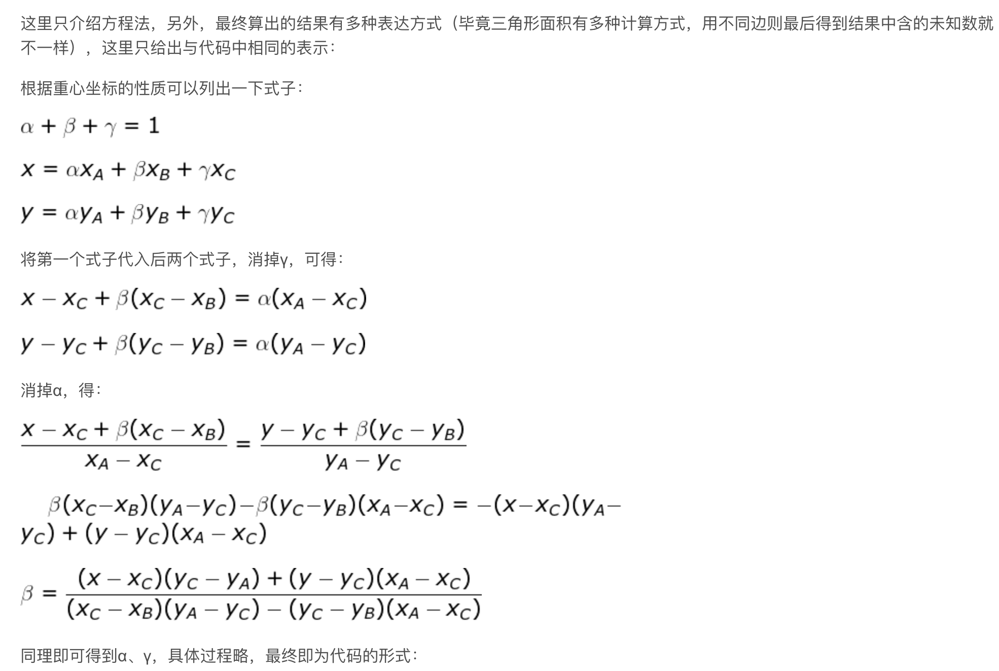

## TODO
- 软光栅化的插值，alpha、betta、gamma
- alpha blend为什么以像素级 还会出现交叉遮挡的情况
  - 难道是因为Transparent队列的深度不是以像素级？因为上来要对物体排序？所以在对物体排序的同时页判定了深度？

## 变换模型空间的法线

不能简单地使用MVP矩阵直接乘，切线可以。我们需要推导：

- 简单来说就是逆 + 转秩


## 光栅化插值

### 求重心坐标

已知三角形重心坐标，求三角形内某点，我们可以根据$\alpha + \beta + \gamma = 1$来求



```c++
static std::tuple<float, float, float> computeBarycentric2D(float x, float y, const Vector4f *v) {
    float c1 = (x * (v[1].y() - v[2].y()) + (v[2].x() - v[1].x()) * y + v[1].x() * v[2].y() - v[2].x() * v[1].y()) /
               (v[0].x() * (v[1].y() - v[2].y()) + (v[2].x() - v[1].x()) * v[0].y() + v[1].x() * v[2].y() -
                v[2].x() * v[1].y());
    float c2 = (x * (v[2].y() - v[0].y()) + (v[0].x() - v[2].x()) * y + v[2].x() * v[0].y() - v[0].x() * v[2].y()) /
               (v[1].x() * (v[2].y() - v[0].y()) + (v[0].x() - v[2].x()) * v[1].y() + v[2].x() * v[0].y() -
                v[0].x() * v[2].y());
    float c3 = (x * (v[0].y() - v[1].y()) + (v[1].x() - v[0].x()) * y + v[0].x() * v[1].y() - v[1].x() * v[0].y()) /
               (v[2].x() * (v[0].y() - v[1].y()) + (v[1].x() - v[0].x()) * v[2].y() + v[0].x() * v[1].y() -
                v[1].x() * v[0].y());
    return {c1, c2, c3};
}
```

### 求深度

这个深度，其实是在NDC下的深度，抑或是经过MVP还没除w的深度。因为使用的深度是那个坐标系的。

要记住，通过重心就可以求出比例

插值得到的无非是一个精确度的问题。

深度得到的并不是MV空间下的，而是经过了透视投影压缩的

其他法线就可以直接通过重心得到准确的数值


```c++
float Z = 1.0 / (alpha / v[0].w() + beta / v[1].w() + gamma / v[2].w());  // 这里用w是不准确的，因为在本例中接近才这样
float zp = alpha * v[0].z() / v[0].w() + beta * v[1].z() / v[1].w() + gamma * v[2].z() / v[2].w();
zp *= Z;  // 插值得到该像素点的深度
```

- Z对应9
- zp对应10的前半部分
- 这里用w代替MVP后的z是不准确的，因为两者不相等。只是用这个做trick，用来比较想对深度而以，不需要纠结