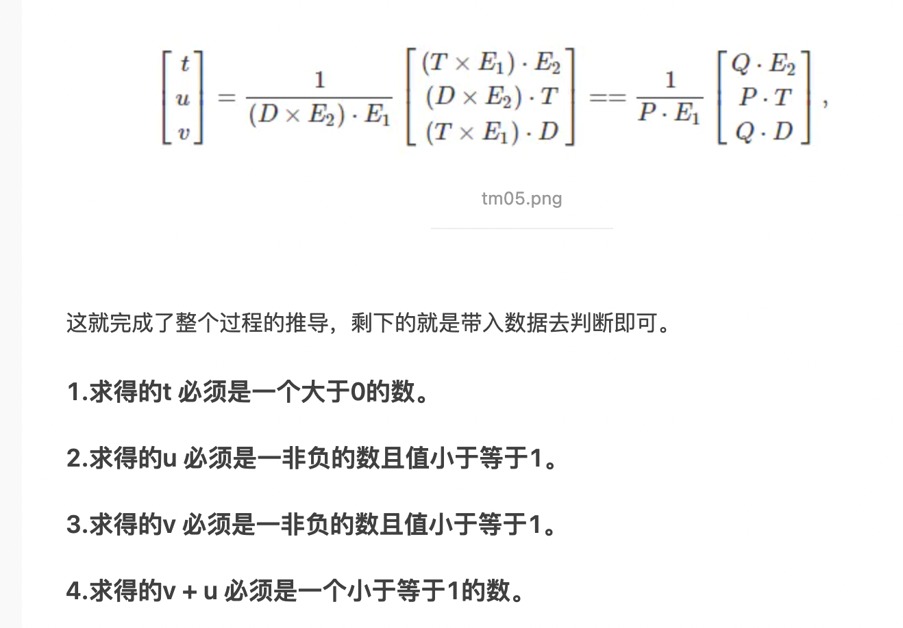

# Ray Tracing

## C++

- Std::move
  - 这个多用于结合push_back使用，可以高效传值
  - 但是传给左值之后，原本的对象是unspecific的，最好不要使用
  - 右值引用只是引用了右值，得到的变量还是左值
  - 接收右值可以用左值也可以用右值，总之接收的都是左值
  - 右值的用处主要是体现在构造，可以在寄存器层面不需要保存，直接构造即可


## 判断直线是否与三角形相交
> Möller-Trumbore Algorithm


**对于三角形，平面内的一点可以通过重心坐标表示**，不需要上式一般的平面表示

```undefined
o + td = aA + uB + vC; 
o + td = (1 - u - v)A + uB + vC; 
=> o + td =  A - uA - vA + uB + vC;
=> o + td =  A + (B - A)u  +  (C - A)v;
=> o - A = -td + (B-A)u + (C-A)v;
```

**运用克莱姆法则：**

- E1 = (B - A) 
- E2 = (C - A) 
- T = (o - A)



